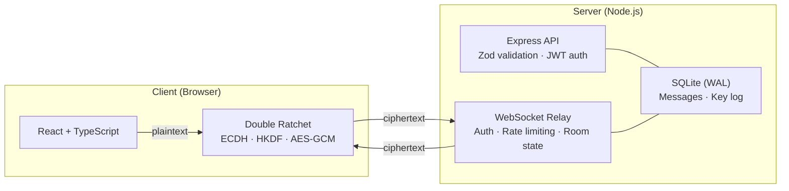

<div align="center">

# Cipher Chat

End-to-end encrypted messaging with a Double Ratchet protocol implementation built from scratch using the Web Crypto API. The server is a ciphertext relay — it never sees plaintext or private keys.


</div>

---

## Quick Start

```bash
docker compose up --build
```

Open `http://localhost:3000`. Register two users in separate browser tabs, create a room, share the room code, and start messaging.

---

## Cryptographic Protocol

The crypto layer implements the **Double Ratchet Algorithm** — the same protocol design used by Signal — entirely in the browser via the Web Crypto API. No third-party crypto libraries.

ECDH P-256 for key agreement, HKDF-SHA-256 for root key derivation, HMAC-SHA-256 for chain key ratcheting, and AES-GCM-256 for authenticated encryption with header binding via AEAD `additionalData`. Fresh ephemeral key pairs are generated on every conversation turn; old private keys are discarded.

> [!NOTE]
> Full protocol specification in [`crypto-spec/key-exchange.md`](crypto-spec/key-exchange.md).
> Security analysis and threat model in [`crypto-spec/threat-model.md`](crypto-spec/threat-model.md).

---

## Architecture



> [!NOTE]
> Detailed backend architecture, API surface, and WebSocket module design in [`backend/README.md`](backend/README.md).

---

## Testing

**86 automated tests** across four layers:

| Layer | Framework | Count | Coverage |
|-------|-----------|:-----:|----------|
| Backend API | Vitest + Supertest | 40 | Auth, keys, rooms, key transparency log, Zod validation |
| Backend WebSocket | Vitest + ws | 9 | Auth handshake, room authorization, message relay |
| Frontend crypto | Vitest + Web Crypto | 18 | ECDH, HKDF, AES-GCM, key fingerprints |
| Double Ratchet | Vitest + Web Crypto | 19 | Roundtrip, forward secrecy, out-of-order, AEAD binding, DoS bounds |

```bash
cd backend  && npm test     # API + WebSocket tests
cd frontend && npm test     # Crypto + Double Ratchet tests
```

---

## Project Structure

```
frontend/
  src/crypto/              Double Ratchet, ECDH, HKDF, AES-GCM (Web Crypto API)
  src/pages/               Chat UI with key transparency warnings

backend/src/
  routes/                  HTTP endpoints with Zod schema validation
  controllers/             Request/response orchestration
  services/                Business logic and authorization
  models/                  SQLite data access (better-sqlite3, WAL mode)
  middleware/              JWT auth + Zod validation middleware
  websocket/               Auth, routing, room state, persistence

crypto-spec/               Protocol specification and threat model
infra/                     GitHub Actions CI workflow
```

---

## Known Limitations

Deliberate scope decisions, documented in the [threat model](crypto-spec/threat-model.md):

| Limitation | Rationale |
|-----------|-----------|
| **No X3DH** | Both users must be online — no prekey bundles for offline session initiation |
| **Ephemeral ratchet state** | State lives in memory; page reload requires new handshake (avoids stale state risks) |
| **Single device** | Identity keys in `localStorage`, no multi-device sync |
| **2-party only** | Ratchet operates between exactly two peers per room |
| **Trust on first use** | Verification is manual; transparency log detects changes but doesn't enforce a PKI |
